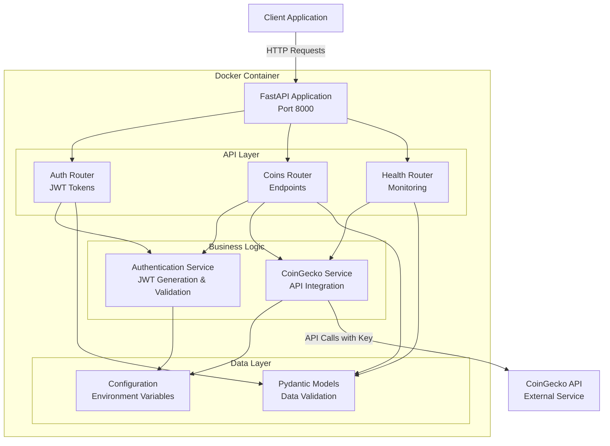
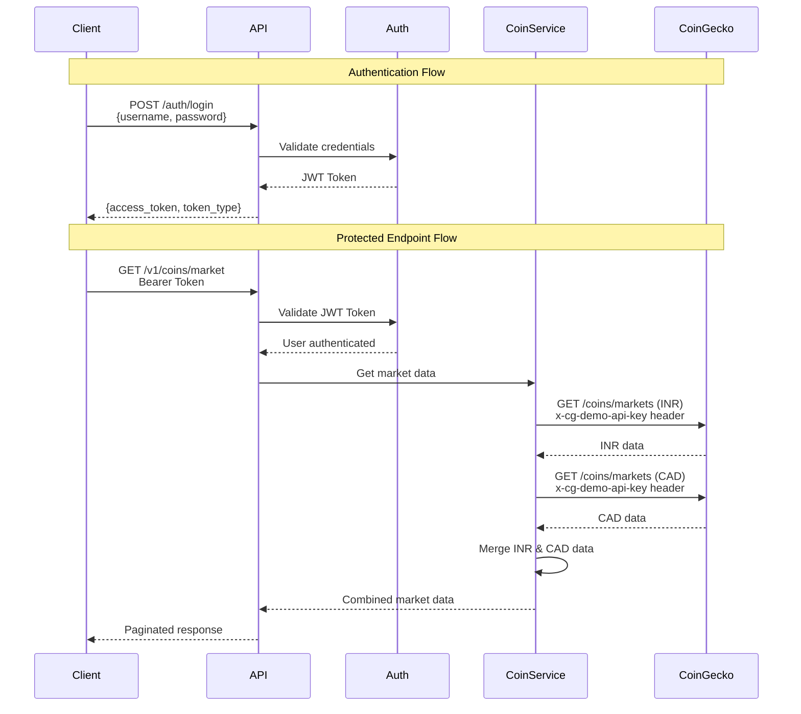
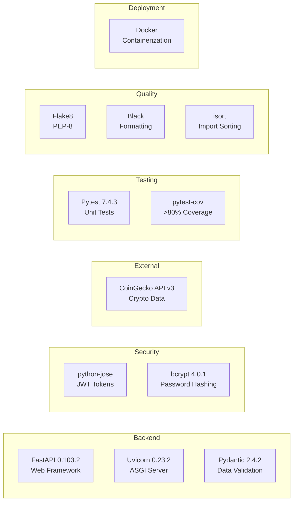

# Cryptocurrency Market API

A REST API for fetching cryptocurrency market updates from CoinGecko. Built with FastAPI, this application provides secure, paginated access to cryptocurrency data with support for multiple currencies (INR and CAD).

## Demo Videos

### API Demo

Watch the complete demo of the API in action:

https://github.com/Optimus-NP/VettyAssignment/assets/Demo.mov

> The demo video shows the complete workflow: authentication, fetching coins, categories, market data with INR/CAD prices, and filtering capabilities.

### Unit Tests Demo

Watch the unit tests execution with coverage results:

https://github.com/Optimus-NP/VettyAssignment/assets/unitTests.mov

> The unit tests video demonstrates all 31 tests passing with 97.25% code coverage, exceeding the 80% requirement.

## Table of Contents
- [Features](#features)
- [Architecture](#architecture)
- [Project Structure](#project-structure)
- [Quick Start](#quick-start)
- [API Documentation](#api-documentation)
- [Testing](#testing)
- [Configuration](#configuration)
- [Development](#development)

## Features

- **JWT-based Authentication**: Secure API access with Bearer token authentication
- **Comprehensive Endpoints**: List coins, categories, and market data
- **Dual Currency Support**: Market data in INR (Indian Rupee) and CAD (Canadian Dollar)
- **Pagination**: Configurable page size with sensible defaults
- **Filtering**: By coin IDs or categories
- **Health Monitoring**: Health check and version endpoints
- **API Documentation**: Interactive Swagger UI and ReDoc
- **Docker Support**: Easy deployment with Docker containers
- **High Test Coverage**: Over 80% code coverage
- **Code Quality**: PEP-8 compliant with linting tools

## Architecture

### System Architecture



### Request Flow



### Technology Stack



## Project Structure

```
VettyAssignment/
├── app/
│   ├── __init__.py
│   ├── main.py              # FastAPI app initialization
│   ├── config.py            # Configuration management
│   ├── auth.py              # JWT authentication
│   ├── models.py            # Pydantic models
│   ├── services.py          # CoinGecko service layer
│   └── routers/
│       ├── __init__.py
│       ├── auth.py          # Authentication endpoints
│       ├── coins.py         # Cryptocurrency endpoints
│       └── health.py        # Health check endpoints
├── tests/
│   ├── __init__.py
│   ├── conftest.py          # Test fixtures
│   ├── test_auth.py         # Authentication tests
│   ├── test_services.py     # Service layer tests
│   └── test_routers.py      # Router tests
├── docs/
│   └── vetty.pdf            # Assignment documentation
├── .env.example             # Example environment variables
├── .env                     # Actual configuration (gitignored)
├── .gitignore
├── requirements.txt         # Python dependencies
├── Dockerfile               # Container configuration
├── .flake8                  # Flake8 configuration
├── pyproject.toml           # Black, isort, pytest config
├── test_all_endpoints.sh    # Automated testing script
└── README.md                # This file
```

## Quick Start

### Prerequisites

- **Docker** (recommended) OR
- **Python 3.10+** with pip
- Git

### Option 1: Using Docker (Recommended)

```bash
# Clone repository
git clone <repository-url>
cd VettyAssignment

# Build and run
docker build -t crypto-api .
docker run -d -p 8000:8000 --env-file .env --name crypto-api crypto-api

# Access the API
open http://localhost:8000/docs  # Swagger UI
```

### Option 2: Local Development

```bash
# Clone repository
git clone <repository-url>
cd VettyAssignment

# Create virtual environment (recommended)
python3 -m venv venv
source venv/bin/activate  # On Linux/Mac

# Install dependencies
pip install -r requirements.txt

# Configure environment
cp .env.example .env
# Edit .env and set SECRET_KEY and COINGECKO_API_KEY

# Run application
python -m uvicorn app.main:app --reload

# Access at http://localhost:8000
```

### Option 3: Automated Testing Script

```bash
# Run comprehensive test suite
./test_all_endpoints.sh

# This will:
# - Build Docker image
# - Start container
# - Test all endpoints
# - Leave container running for manual testing
```

## API Documentation

### Access Documentation

Once running, visit:
- **Swagger UI**: http://localhost:8000/docs (interactive)
- **ReDoc**: http://localhost:8000/redoc (reference)
- **OpenAPI JSON**: http://localhost:8000/openapi.json

### Authentication

**Step 1: Get JWT Token**

```bash
curl -X POST "http://localhost:8000/auth/login" \
  -H "Content-Type: application/json" \
  -d '{"username": "demo", "password": "demo123"}'
```

Response:
```json
{
  "access_token": "eyJhbGciOiJIUzI1NiIsInR5cCI6IkpXVCJ9...",
  "token_type": "bearer"
}
```

**Step 2: Use Token in Requests**

```bash
curl -X GET "http://localhost:8000/v1/coins/" \
  -H "Authorization: Bearer YOUR_ACCESS_TOKEN"
```

### API Endpoints

#### Public Endpoints (No Authentication)

| Method | Endpoint | Description |
|--------|----------|-------------|
| GET | `/health/` | Health check for API and CoinGecko |
| GET | `/health/version` | Get API version information |
| POST | `/auth/login` | Login and receive JWT token |

#### Protected Endpoints (Requires JWT Token)

| Method | Endpoint | Description | Parameters |
|--------|----------|-------------|------------|
| GET | `/v1/coins/` | List all coins | `page_num`, `per_page` |
| GET | `/v1/coins/categories` | List coin categories | `page_num`, `per_page` |
| GET | `/v1/coins/market` | Get market data in INR & CAD | `coin_ids`, `category`, `page_num`, `per_page` |

### Query Parameters

**Pagination (All list endpoints):**
- `page_num` (integer, default: 1) - Page number, starts from 1
- `per_page` (integer, default: 10, max: 100) - Items per page

**Filtering (Market data endpoint):**
- `coin_ids` (string, optional) - Comma-separated coin IDs (e.g., "bitcoin,ethereum")
- `category` (string, optional) - Category ID (e.g., "decentralized-finance-defi")

### Example Requests

**List coins with pagination:**
```bash
curl -X GET "http://localhost:8000/v1/coins/?page_num=1&per_page=10" \
  -H "Authorization: Bearer YOUR_TOKEN"
```

**List categories:**
```bash
curl -X GET "http://localhost:8000/v1/coins/categories?page_num=1&per_page=10" \
  -H "Authorization: Bearer YOUR_TOKEN"
```

**Get market data for specific coins:**
```bash
curl -X GET "http://localhost:8000/v1/coins/market?coin_ids=bitcoin,ethereum" \
  -H "Authorization: Bearer YOUR_TOKEN"
```

**Get coins by category:**
```bash
curl -X GET "http://localhost:8000/v1/coins/market?category=decentralized-finance-defi&per_page=5" \
  -H "Authorization: Bearer YOUR_TOKEN"
```

**Get top coins with pagination:**
```bash
curl -X GET "http://localhost:8000/v1/coins/market?page_num=1&per_page=20" \
  -H "Authorization: Bearer YOUR_TOKEN"
```

## Testing

### Automated End-to-End Testing

Run the comprehensive test script:

```bash
./test_all_endpoints.sh
```

**What it tests:**
- Container lifecycle (build, start, stop)
- Health check and version endpoints
- Authentication and JWT tokens
- Coins list with pagination (multiple scenarios)
- Categories with pagination
- Market data with INR & CAD prices
- Filtering by coin IDs
- Filtering by categories
- Security (unauthorized access, invalid tokens)

### Unit Tests

**Run all tests:**
```bash
pytest
```

**Run with coverage report:**
```bash
pytest --cov=app --cov-report=term-missing --cov-report=html
```

**Run specific test files:**
```bash
pytest tests/test_auth.py
pytest tests/test_services.py
pytest tests/test_routers.py
```

**View HTML coverage report:**
```bash
# After running pytest with html report
open htmlcov/index.html  # Mac/Linux
```

### Code Quality

**Check PEP-8 compliance:**
```bash
flake8 app tests
```

**Check code formatting:**
```bash
black --check app tests
```

**Check import sorting:**
```bash
isort --check-only app tests
```

**Auto-format code:**
```bash
black app tests
isort app tests
```

## Configuration

### Environment Variables

The application is configured via `.env` file:

| Variable | Description | Default | Required |
|----------|-------------|---------|----------|
| `SECRET_KEY` | JWT secret key | dev-secret-key | Yes (change in production) |
| `DEMO_USERNAME` | Demo user username | demo | No (for testing) |
| `DEMO_PASSWORD` | Demo user password | demo123 | No (for testing) |
| `COINGECKO_API_KEY` | CoinGecko Demo API key | - | No (but recommended) |
| `API_VERSION` | API version | 1.0.0 | No |
| `ALGORITHM` | JWT algorithm | HS256 | No |
| `ACCESS_TOKEN_EXPIRE_MINUTES` | Token expiration | 30 | No |
| `COINGECKO_API_BASE_URL` | CoinGecko API URL | https://api.coingecko.com/api/v3 | No |
| `COINGECKO_API_TIMEOUT` | API timeout (seconds) | 30 | No |
| `DEFAULT_PAGE_SIZE` | Default pagination size | 10 | No |
| `MAX_PAGE_SIZE` | Maximum pagination size | 100 | No |
| `HOST` | Server host | 0.0.0.0 | No |
| `PORT` | Server port | 8000 | No |

### Setup Configuration

```bash
# Copy example file
cp .env.example .env

# Edit .env and set required values
SECRET_KEY=your-secure-secret-key-here-min-32-chars
COINGECKO_API_KEY=your-coingecko-demo-api-key  # Optional but recommended
```

**Getting CoinGecko API Key:**
1. Visit [CoinGecko Developer Dashboard](https://www.coingecko.com/en/developers/dashboard)
2. Sign up for a free Demo API account
3. Generate your API key
4. Add it to `.env` file

**Note:** The API key is optional but highly recommended to avoid rate limiting.

## Docker Deployment

### Build Image

```bash
docker build -t crypto-api .
```

### Run Container

**With environment file:**
```bash
docker run -d \
  -p 8000:8000 \
  --env-file .env \
  --name crypto-api \
  crypto-api
```

**With individual environment variables:**
```bash
docker run -d \
  -p 8000:8000 \
  -e SECRET_KEY=your-secret-key \
  -e COINGECKO_API_KEY=your-api-key \
  --name crypto-api \
  crypto-api
```

### Container Management

```bash
# Check logs
docker logs crypto-api

# Check status
docker ps

# Stop container
docker stop crypto-api

# Remove container
docker rm crypto-api

# Restart container
docker restart crypto-api
```

## Development

### Setup Development Environment

```bash
# Clone repository
git clone <repository-url>
cd VettyAssignment

# Create virtual environment
python3 -m venv venv
source venv/bin/activate  # Linux/Mac
# OR
venv\Scripts\activate  # Windows

# Install dependencies
pip install -r requirements.txt

# Configure environment
cp .env.example .env
# Edit .env with your settings

# Run in development mode
python -m uvicorn app.main:app --reload
```

### Development Workflow

1. Create a feature branch
2. Make changes following PEP-8 guidelines
3. Write tests for new functionality
4. Run tests: `pytest --cov=app`
5. Check code quality: `flake8 app tests`
6. Format code: `black app tests && isort app tests`
7. Commit with clear messages
8. Push and create pull request

### Adding New Features

**Example: Adding a new endpoint**

1. Define models in `app/models.py`
2. Add business logic in `app/services.py`
3. Create router in `app/routers/`
4. Register router in `app/main.py`
5. Write tests in `tests/`
6. Update API documentation

## Security Considerations

### Production Deployment

1. **Change SECRET_KEY**: Use a strong, randomly generated key (min 32 characters)
   ```bash
   python -c "import secrets; print(secrets.token_urlsafe(32))"
   ```

2. **Use HTTPS**: Deploy behind reverse proxy (nginx, traefik) with SSL/TLS

3. **Restrict CORS**: Update `app/main.py` to allow only specific origins

4. **Rate Limiting**: Implement rate limiting for production (e.g., slowapi)

5. **Database Authentication**: Replace demo credentials with proper user database

6. **API Key Security**: Store CoinGecko API key securely, use secrets management

7. **Container Security**: Run as non-root user (already configured in Dockerfile)

### Demo Credentials

**For testing only:**
- Username: `demo`
- Password: `demo123`

**Important:** Change these before production deployment!

## Troubleshooting

### Common Issues

**Port 8000 already in use:**
```bash
# Option 1: Use different port
docker run -d -p 8001:8000 --env-file .env --name crypto-api crypto-api

# Option 2: Change PORT in .env
PORT=8001
```

**CoinGecko API rate limiting (429 errors):**
- Add CoinGecko API key to `.env` file
- Wait a few minutes before retrying
- Reduce request frequency
- Consider upgrading to paid CoinGecko plan

**Docker permission denied:**
```bash
# Add user to docker group
sudo usermod -aG docker $USER
# Log out and back in
```

**Container fails to start:**
```bash
# Check logs
docker logs crypto-api

# Rebuild image
docker build --no-cache -t crypto-api .
```

**Dependencies installation fails:**
```bash
# Use Docker (recommended)
docker build -t crypto-api .

# Or create clean virtual environment
python3 -m venv venv
source venv/bin/activate
pip install --upgrade pip
pip install -r requirements.txt
```

### Health Check

**Verify API is running:**
```bash
curl http://localhost:8000/health/
```

**Expected response:**
```json
{
  "status": "healthy",
  "version": "1.0.0",
  "coingecko_status": "healthy"
}
```

## API Response Examples

### Coins List Response

```json
{
  "data": [
    {
      "id": "bitcoin",
      "symbol": "btc",
      "name": "Bitcoin"
    }
  ],
  "page": 1,
  "per_page": 10,
  "total": 19257
}
```

### Market Data Response

```json
{
  "data": [
    {
      "id": "bitcoin",
      "symbol": "btc",
      "name": "Bitcoin",
      "current_price_inr": 8102752.0,
      "current_price_cad": 124814.0,
      "market_cap_inr": 160000000000.0,
      "market_cap_cad": 2470000000.0,
      "total_volume_inr": 3200000000.0,
      "total_volume_cad": 49300000.0,
      "price_change_percentage_24h": 2.5,
      "market_cap_rank": 1
    }
  ],
  "page": 1,
  "per_page": 10,
  "total": 2
}
```

## Performance

- **Response Time**: < 2s for most endpoints (depends on CoinGecko API)
- **Concurrent Requests**: Handles multiple simultaneous requests
- **Caching**: Can be added for improved performance
- **Rate Limiting**: Managed by CoinGecko API key

## Compliance

### Assignment Requirements

✅ **Basic Requirements:**
- HTTP REST API with version 1.0
- List all coins including coin ID
- List coin categories
- List specific coins with market data (INR & CAD)
- Pagination (page_num, per_page)
- JWT authentication
- API documentation (Swagger)
- Unit tests with >80% coverage

✅ **Extra Requirements:**
- Docker support (Dockerfile, no docker-compose)
- Health check and version endpoints
- Linting and quality control integration

✅ **Code Quality:**
- PEP-8 compliant (flake8)
- Clean, readable code (KISS, DRY, Zen of Python)
- Well-structured project
- Secure configuration (environment variables)
- Good git commits
- Comprehensive comments

## Technology Details

### Dependencies

**Core:**
- fastapi==0.103.2 - Web framework
- uvicorn==0.23.2 - ASGI server
- pydantic==2.4.2 - Data validation
- pydantic-settings==2.0.3 - Settings management

**Security:**
- python-jose==3.3.0 - JWT handling
- bcrypt==4.0.1 - Password hashing
- passlib==1.7.4 - Password utilities

**External:**
- requests==2.31.0 - HTTP client for CoinGecko API

**Testing:**
- pytest==7.4.3 - Testing framework
- pytest-cov==4.1.0 - Coverage reporting
- pytest-asyncio==0.21.1 - Async testing
- httpx==0.25.0 - Async HTTP client for tests

**Code Quality:**
- flake8==6.1.0 - Linting
- black==23.10.1 - Code formatting
- isort==5.12.0 - Import sorting

## License

This project is created as part of a technical assignment for Vetty.

## Support

For issues or questions:
1. Check the troubleshooting section above
2. Review the API documentation at `/docs`
3. Check CoinGecko API status: https://status.coingecko.com/
4. Refer to the assignment documentation in `docs/vetty.pdf`

## Contact

**Demo Credentials:**
- Username: `demo`
- Password: `demo123`

**CoinGecko API:**
- API Key: Configured in `.env` file
- Base URL: https://api.coingecko.com/api/v3
- Authentication: x-cg-demo-api-key header

---

**Repository:** https://github.com/Optimus-NP/VettyAssignment  
**Version:** 1.0.0
